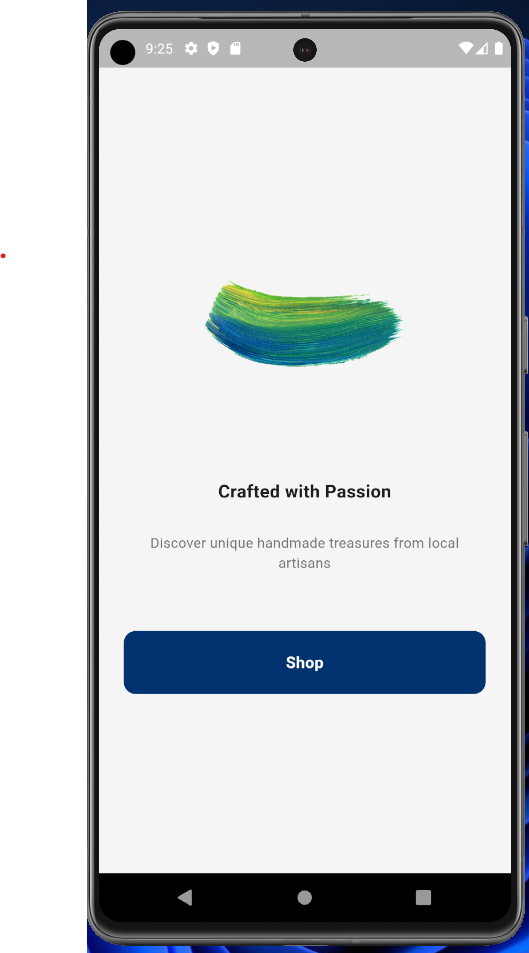
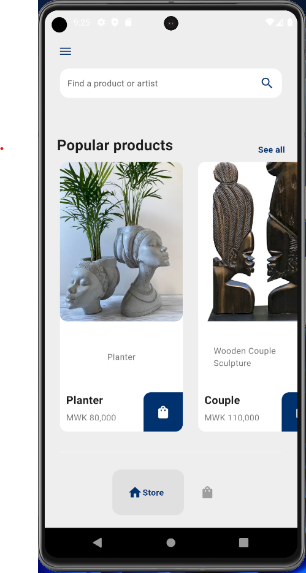
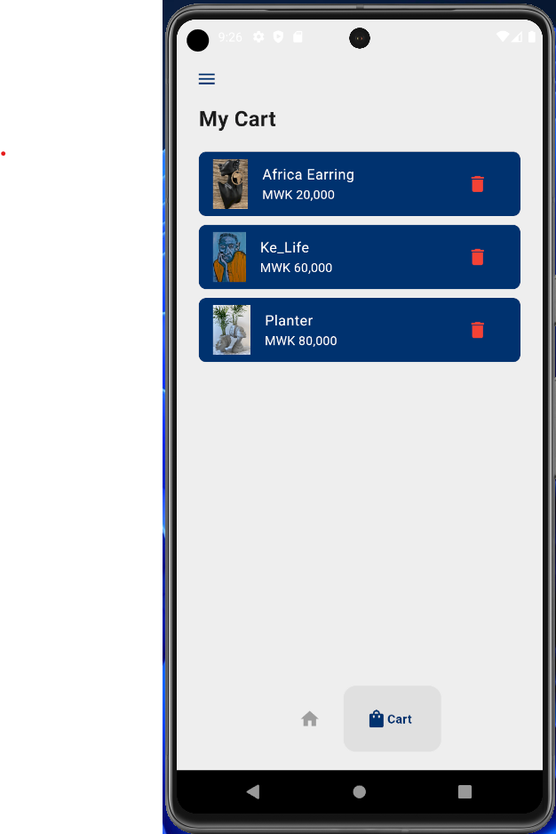
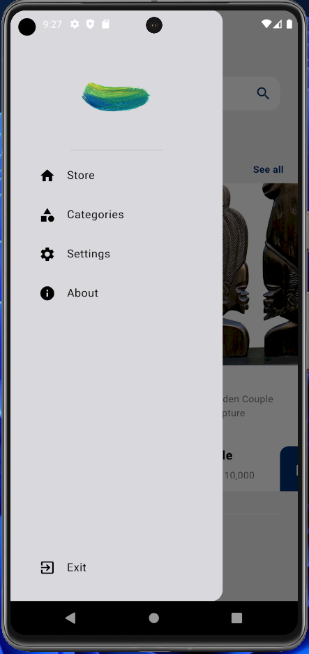

# Crafted With Passion Ecommerce App

A simple Flutter project for arts and crafts enthusiasts, offering a curated selection of handmade goods.

## Features

- Browse a selection of handmade goods.
- User-friendly interface for easy navigation.
- Explore and add/delete items in your cart.

## Getting Started

1. Clone the repository to your local machine.
2. Navigate to the project directory.
3. Install dependencies.
4. Run the app.

## Screenshots

| Homepage | Store Page |
|----------|------------|
|  |  |

| Cart Page | Drawer |
|-----------|--------|
|  |  |
